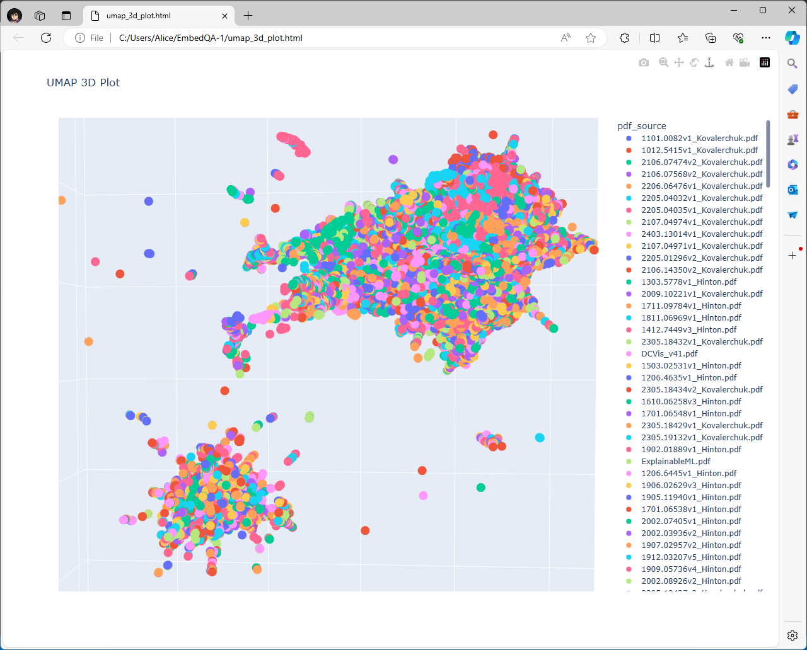
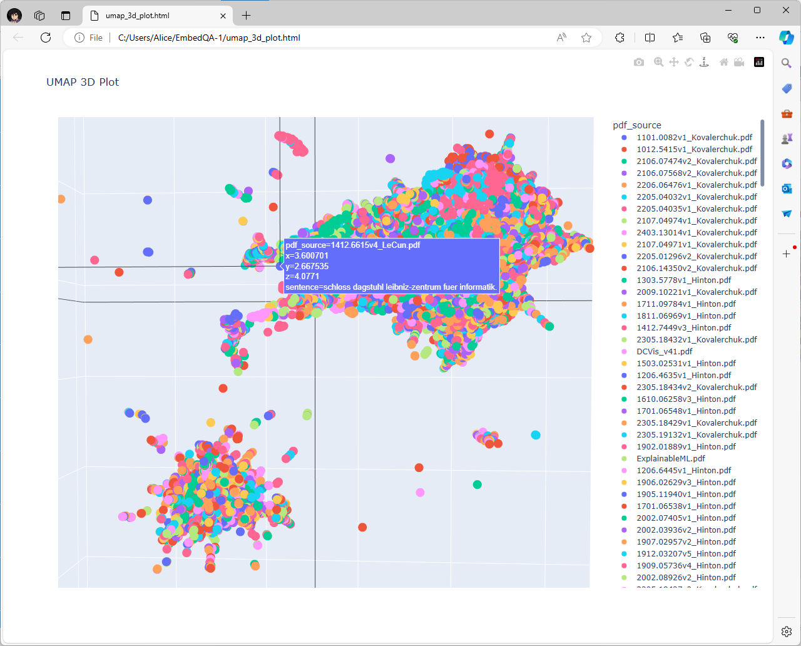

# LocalDocRAG

Local Document Retrieval Augmented Generation (RAG) with sentence embedding context for cited question answering with small language models (LM).

## Current Status

Project concept demonstrated, Reader-Answerer model begun, next visualization of semantic search. Currently runs in terminal again, will add GUI back soon.

## Overview

Reader: Load Files -> Parse Sentences -> Generate Sentence Embeddings -> Tag and Store in CSV
Answerer: Load Sentences CSV -> Request User Query -> (Preprocess Query with LM slower but helps if query could be malformed or poorly articulated) -> Generate Embedding of Query -> Find ALL Sentences with Cosine Similarity above threshold (we used 0.50 = 50%) -> Sort Context Sentences by Similarity Metric (looking at neighboring sentences improves sort but is also slower) -> If length above max input of LM generate summary with LM (ASSUMED TO HAPPEN ALWAYS IF ENOUGH KNOWLEDGE IN CORPUS) -> Build Prompt -> Generate Answer with LM -> List Context Sources

## Current Status

## Installation

1. **Clone the repository**:

    ```sh
    git clone https://github.com/your-username/EmbedQA.git
    cd EmbedQA
    ```

2. **Install the required packages**:

    ```sh
    pip install -r requirements.txt
    ```

## Usage

### Running the Application

1. **Scrape PDF Content**:
    - Run the script to scrape PDF content.

    ```sh
    python src/scrape.py
    ```

2. **Clean the Extracted Text**:
    - Run the script to clean the extracted text.

    ```sh
    python src/extract_clean_text.py
    ```

3. **Generate Embeddings**:
    - Run the script to generate embeddings for the cleaned text.

    ```sh
    python src/create_embeddings.py
    ```

4. **Visualize the Embeddings**:
    - Run the scripts to visualize embeddings using various dimensionality reduction techniques.

    ```sh
    python src/visualize_embeddings_in_DR.py  # For dimensionality reduction visualization
    python src/visualize_embeddings_in_PC.py  # For parallel coordinates visualization
    ```

5. **Chat Interface**:
    - The chat interface is currently unimplemented in the new version.

### Explanation of the Process

1. **PDF Extraction**:
    - Load PDF files from the specified directory and extract text from each page using `PyMuPDF`.

2. **Text Cleaning and Splitting**:
    - Clean the extracted text by removing HTML tags, non-ASCII characters, and multiple spaces.
    - Split the cleaned text into sentences and filter out sentences that are not semantically useful (e.g., too short, contain mostly numbers/symbols).

3. **Embedding Generation**:
    - Generate sentence embeddings using the `sentence-transformers` model `nli-roberta-large`.

4. **Saving and Loading Embeddings**:
    - Save the generated embeddings and their corresponding sentences to a CSV file.
    - Load the embeddings from the CSV file for similarity search.

5. **Similarity Search**:
    - Use the `sentence-transformers` model to find the top k most similar sentences to the user query based on cosine similarity.

6. **Contextual Response Generation**:
    - Extract the neighboring sentences for each of the top k similar sentences.
    - Combine these sentences to form a context.
    - Use the `transformers` model `deepset/roberta-large-squad2` to generate a response based on the combined context.

7. **Graphical User Interface**:
    - Provide a Tkinter-based GUI for users to input their questions and receive responses.
    - Display the top k most similar sentences and the generated response.

## Embeddings Generation for Non-NVIDIA Systems

To support systems without NVIDIA GPUs, we convert the PyTorch model to ONNX format and use ONNX Runtime with DirectML. This enables the use of hardware-accelerated inference on a broader range of devices, including those with AMD or Intel GPUs.

## Subprograms for Clustering and Visualization

### Clustering and Dimensionality Reduction

We use several techniques to explore clusters of semantic similarity within the embeddings:

- **PCA (Principal Component Analysis)**: Reduces the dimensionality of embeddings to three principal components for 3D visualization.
- **t-SNE (t-Distributed Stochastic Neighbor Embedding)**: Reduces the dimensionality to three components, focusing on preserving local similarities.
- **UMAP (Uniform Manifold Approximation and Projection)**: Another dimensionality reduction technique that preserves more of the global structure compared to t-SNE.

### Visualization

- **3D Plots**: We create 3D scatter plots of the reduced embeddings using Plotly. These plots allow interactive exploration of the clusters, with additional features like hovering over points to see the associated sentences.
- **JavaScript Integration**: Custom JavaScript is added to enable copying the text of a sentence to the clipboard when clicked.

## Tuning Hyperparameters with Dash

We provide a Dash application for tuning UMAP hyperparameters. This application allows users to adjust parameters such as the number of neighbors, minimum distance, and metric used for computing the UMAP embedding. The resulting embeddings are visualized in a 3D scatter plot, facilitating the exploration of different clustering behaviors.

## Screenshots

### UMAP Visualization 1



### UMAP Visualization 2: Subcluster of Sentences with German Words



## Dependencies

- `PyMuPDF`: For extracting text from PDF files.
- `sentence-transformers`: For generating sentence embeddings.
- `transformers`: For question answering.
- `nltk`: For natural language processing tasks such as tokenization and stopword removal.
- `spacy`: For advanced natural language processing tasks.
- `scikit-learn`: For dimensionality reduction (PCA, t-SNE).
- `umap-learn`: For UMAP dimensionality reduction.
- `matplotlib`: For plotting embeddings.
- `plotly`: For interactive plotting.
- `tkinter`: For creating the graphical user interface.
- `beautifulsoup4`: For cleaning HTML tags from text.
- `dash`: For building the hyperparameter tuning web app.

## License

This project is licensed under the MIT License.
